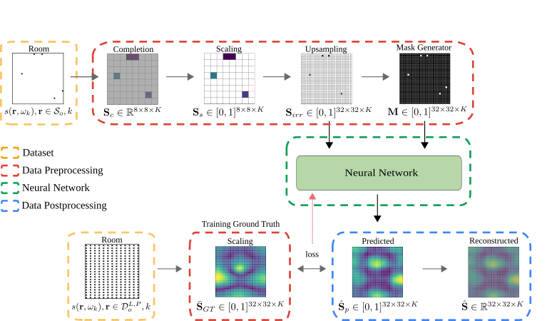

Sound field reconstruction in rooms: inpainting meets superresolution
====

Deep learning for sound field reconstruction in rooms.

[Paper](https://arxiv.org/abs/2001.11263) by Francesc Lluís, Pablo Martínez-Nuevo, Martin Bo Møller, Sven Ewan Shepstone

We provide an implementation of the deep-learning-based method for sound field reconstruction presented in the aforementioned paper. It uses a limited number of arbitrary discrete measurements of the magnitude of the sound field pressure in order to extrapolate this field to a higher-resolution grid of discrete points in space with a low computational complexity. The method is based on a U-net-like neural network with partial convolutions trained solely on simulated data, i.e. the dataset is constructed from numerical simulations of the Green's function across thousands of common rectangular rooms. Although extensible to three dimensions, the method focuses on reconstructing a two-dimensional plane of the room from measurements of the three-dimensional sound field.


## Algorithm Design




Note that the provided pre-trained model predicts the 2D sound field with 1/12th octave frequency resolution in the range [30, 296] Hz


## Features
* Suitable for rectangular or symmetric rooms
* Low number of microphones required
* Accommodate irregular microphone distributions
* Efficient Inference

## Setup

1. Install [miniconda](https://docs.conda.io/en/latest/miniconda.html)
2. Through Anaconda Prompt, create virtual environment and install dependencies:

```
conda create -n deep_learning_module python=3.6 
conda activate deep_learning_module
conda install -c anaconda scipy
conda install -c anaconda pandas
conda install -c conda-forge matplotlib
conda install -c anaconda scikit-image
conda install -c conda-forge keras==2.2.4
conda install -c conda-forge opencv
conda install -c conda-forge tensorflow==1.12
```
**Bugfix**

In command prompt, while in deep_learning_module directory:

ON WINDOWS
```
copy bugfix\saving.py path-to-virtual-environment\lib\site-packages\keras\engine\saving.py
```
ON LINUX
```
cp bugfix/saving.py path-to-virtual-environment\lib\site-packages\keras\engine\saving.py

Example:
```
copy bugfix\saving.py C:\Users\aleogd\miniconda3\envs\deep_learning_module\Lib\site-packages\keras\engine\saving.py
```

3. Set storage's path on `config/initial_config.json` if required. By default it is set in the same driver as neural network and creation modules


The project has been tested with Keras 2.2.4, CUDA 8.0, CUDNN 7.1.3 on Ubuntu 18.04 LTS. We reuse code from [MathiasGruber/PConv-Keras](https://github.com/MathiasGruber/PConv-Keras).


## Dataset

Scripts used for generating simulated sound fields are provided inside the `create_data` folder. Tested under Matlab 2018. Special thanks to Martin Bo Møller for the Green's function implementation.


## Module Schema:

* `main.py`: main file to run the application.
* `data.py`: functionalities to load and process the data applied in the network.
* `inference.py`: functionalities related to infer the soundfields using trained models.
* `evaluation.py`: functionalities to evaluate the quality of prediction.
* `sfun.py`: definition of neural network's architecture and parameters.
* `training.py`: functionalities related to start the training of a model.
* `util`: contains general functions and files required to the main applications.
* `config`: contains the initial_config, setting the parameters for a new model to be created and start the training.
* `create_dataset`: matlab scripts used to create the original dataset
* `img`: images applie in the repo.
* `sessions`: stores session_0, containing a trained model ready to be used.
